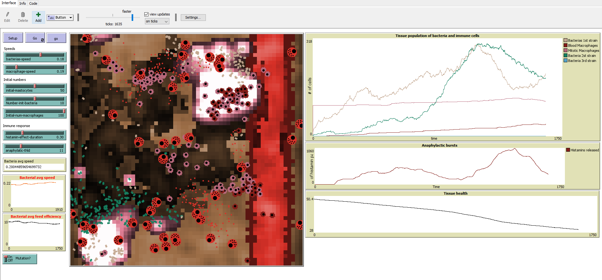

# NETLOGO BACTERIAL INFECTION MODEL
## WHAT IS IT?

This model illustrates the dynamics of macrophages, bacteria, and mastocytes in inflammatory processes on vascularized epithelium tissue. It can be thought of as a cross-section of skin where invading bacteria feed of the healthy tissue causing damage while triggering the tissue’s immune response.

The immune response is controlled by cytokines, a category of signaling molecules that mediate and regulate immunity, inflammation, and hematopoiesis. Cytokines are released when bacteria feed on the tissue or when a macrophage phagocytes a bacterium. The high concentration of cytokines creates a positive gradient that recruits more macrophages to an area, stimulates mitoses of macrophages, and the release of histamine by Mastocytes.

In this toy model, bacteria can evolve to try to avoid the immune system by either increasing the speed with which they move while sacrificing feed efficiency or vice-versa, depending on the environment determined by the infection state. Macrophages do not evolve but can have two different origins, native from the tissue (Mitotic macrophages) or recruited from the bloodstream (Blood macrophages), and play a crucial role in controlling the liberation of histamine by the mastocytes.

In the fight against an infection, the interaction between different defense mechanisms creates very interesting patterns and defense strategies, some of which can be explored in a simplified way in this model.

### Screen shot

## HOW IT WORKS

#### Moviment
There are three main types of agents in this model, which are bacteria (visualized as colored ovals), mastocytes (visualized as big red doted circles), and macrophages (visualized as colored spiky circles with a black dot).

Bacteria wander the tissue randomly, destroying and eating epithelium and endothelial cells (visualized as brow and red patches, respectively) to gain energy as they move. In the absence of a cytokine gradient, macrophages move randomly in the healthy tissue and receive nutrition. When macrophages detect cytokines, they move toward the positive cytokine gradient. Mastocytes are fixed cells that do not die, multiply or need to feed. Bacteria and macrophages will die if they run out of energy, for example, by moving extensively on tissue that is severally damaged and low in nutrients.

Bacteria speed defines how fast they move, and feed efficiency determines how much energy the bacteria spend in each clock tick. Increasing speed is an effective way for bacteria to evade the immune defenses, but mutations that increase speed also reduce the feed efficiency as faster movement requires more energy per step. As a result, faster bacteria are more efficient to evade the immune system but are more likely to die by starvation.

#### Multiplication and mutations
Bacteria will divide if they accumulate enough energy. When bacteria divide, they have a chance of mutating the speed and feed efficiency. The mutations are transmitted to the next generations. Bacteria can have different colors to express their level of mutation:

* Light brown: slow speed, high feed efficiency.
* Green: medium speed, medium feed efficiency.
* Light blue: fast speed, low feed efficiency.

Macrophages have a chance to undergo mitosis if they are amidst a large concentration of cytokines, originating pink macrophages (mitotic macrophages). Cytokines that fall in the blood vessel can also recruit macrophages from other tissues (blood macrophages) that are red. The two types of macrophages (pink and red) are functionally identical, and the color difference serves to track the type of defense (local or systemic) more active in each stage of the infection.

#### Molecular mediators
Cytokines are released in small quantities when bacteria destroy healthy tissue and at large amounts when a macrophage phagocyte a bacterium. They are represented by the white-pinkish flashes released on tissue patches. Usually, the release of cytokines by dying tissue is enough to recruit nearby macrophages but not sufficient to trigger mastocytes' histamine release. The aim is to represent the crucial role that phagocytosis play in mediating other immune responses.

Histamine (small red dots) released by mastocytes has a short duration on the tissue, but their role in the immune response is paramount. When bacteria feed off a patch that contains active histamine, it loses its mobility and becomes an easy target for macrophages or death by starvation.

#### Agents deaths

Macrophages die when they starve by moving throughout damaged tissue. Bacteria die when they are phagocyted by macrophages or die of starvation by moving in damaged tissue. Histamine disappears after the set duration time of its effect.

## HOW TO USE IT

This model can be used to observe the interaction between immune cells and their immune mediators and possible outcomes of an infectious process. 

### Buttons
#### Setup
Initializes variables and creates the initial bacteria, macrophages, and mastocytes. 
#### Go
Runs the model
### Sliders and Switches 
#### Initial-mastocytes
This slider controls the number of mastocytes in the tissue at the beginning of the simulation.
#### Number-ini-bacteria
This slider controls the number of bacteria infecting the tissue at the beginning of the simulation.
#### Initial-num-macrophages
This slider controls the number of macrophages in the beginning of the simulation.
#### Histamine-effect-duration
This slider defines for how long the released histamine will stay active in the tissue
#### Initial-bacterias-speed
This slider defines the initial bacteria speed and its correspondent feed efficiency   
#### Macrophage-speed
This slider defines the fixed macrophages speed
#### Histamine-release-threshold
This slide determines the minimum concentration of cytokines needed to trigger the release of histamine by mastocytes.
#### Mutation?
Switch on and off the possibility of bacteria to suffer mutation.

### Plots and monitors

#### Bacteria avg speed - Monitor
This monitor shows the current average bacterial speed.

#### Bacteria avg speed - Plot
This plot shows the evolution of bacterial speed over time.

#### Bacteria avg feed efficiency
This plot shows the evolution of bacterial feed efficiency over time as a result of mutation and selection pressure.

#### Tissue population of bacteria and immune cells
Plots the total cell number for each type of cell (bacteria from the 3 possible types and macrophages from the 2 different origins) 

#### Anaphylactic bursts
Plots the number of active histamine molecules over time.

#### Tissue Health
Plots the mean amount of food available for bacteria and macrophages. The measurement of tissue food can be understood as a proxy for its health status

## THINGS TO NOTICE

When clicking in "go" take some time to watch what is happening in the simulation. Notice how the cytokines signals draw macrophages to where the bacteria are. After successful phagocytosis, observe how the macrophages amplify the cytokines signal triggering other responses such as the mitosis and recruitment of other macrophages and the bursts of histamine by mastocytes. Is this kind of interaction and amplification of signals a common feature in the immune responses? In a living organism, is it true that the larger the immune response to infection, the better?

After a while of playing with the simulation, you will probably observe scenarios where the immune system subsides the infection and others where the infection becomes chronic. What are the relevant factors that determine these two possible outcomes? Is it possible to quell the infection by allowing either macrophages or mastocytes to defend the tissue alone? What are the conditions for that? Is it viable in a living organism?

The macrophages and bacteria depend on living tissue to thrive. Both feed on the nutrients available there. After the installation of a chronic infection, what happens with the overall tissue health (available food)? Does that favor bacteria or macrophages? Does it resemble what happens in reality?

As time goes on, observe how the bacterial population changes and how the number of defense cells and histamine release fluctuates. Is there a relationship between tissue health, histamine releases, and the number of macrophages?

## THINGS TO TRY

Try changing the initial number of bacterias (bacterial load) to see how that affects the speed and probability of a severe infection.

Another interesting possibility is to observe how natural selection affects the predominant bacteria. Try to switch on and off the mutation knob to see how that affects the chances of the infection to thrive. 

Play with the different histamine characteristics (release threshold and duration). 

## EXTENDING THE MODEL

Try adding other immune cells and signaling molecules such as lymphocytes and interleukins, respectively. 

## DISCLAIMER

This model was developed as a course requirement. The focus was to develop skills and understanding of agent-based modeling. Therefore,  the data, the description of the interaction between cells, and the biological variables mentioned here are by no means validated. Any conclusion about bacterial infections taken from this simulation will probably be incomplete or wrong.

## CREDITS AND REFERENCES

Code in this model made use of several solutions found in the models below:

* Woods, P. and Wilensky, U. (2019). NetLogo CRISPR Ecosystem model. http://ccl.northwestern.edu/netlogo/models/CRISPREcosystem. Center for Connected Learning and Computer-Based Modeling, Northwestern University, Evanston, IL.

* Wilensky, U. (1997). NetLogo Ants model. http://ccl.northwestern.edu/netlogo/models/Ants. Center for Connected Learning and Computer-Based Modeling, Northwestern University, Evanston, IL.

* Dunham, G., Tisue, S. and Wilensky, U. (2004). NetLogo Erosion model. http://ccl.northwestern.edu/netlogo/models/Erosion. Center for Connected Learning and Computer-Based Modeling, Northwestern University, Evanston, IL.

## HOW TO CITE

If you mention this model or the NetLogo software in a publication, we ask that you include the citations below.

For the model itself:

* Alves, Marcos (2021).  NetLogo Bacterial Infection Model.  https://github.com/mppalves/NetLogo_Bacterial_Infection_Model.

Please cite the NetLogo software as:

* Wilensky, U. (1999). NetLogo. http://ccl.northwestern.edu/netlogo/. Center for Connected Learning and Computer-Based Modeling, Northwestern University, Evanston, IL.

